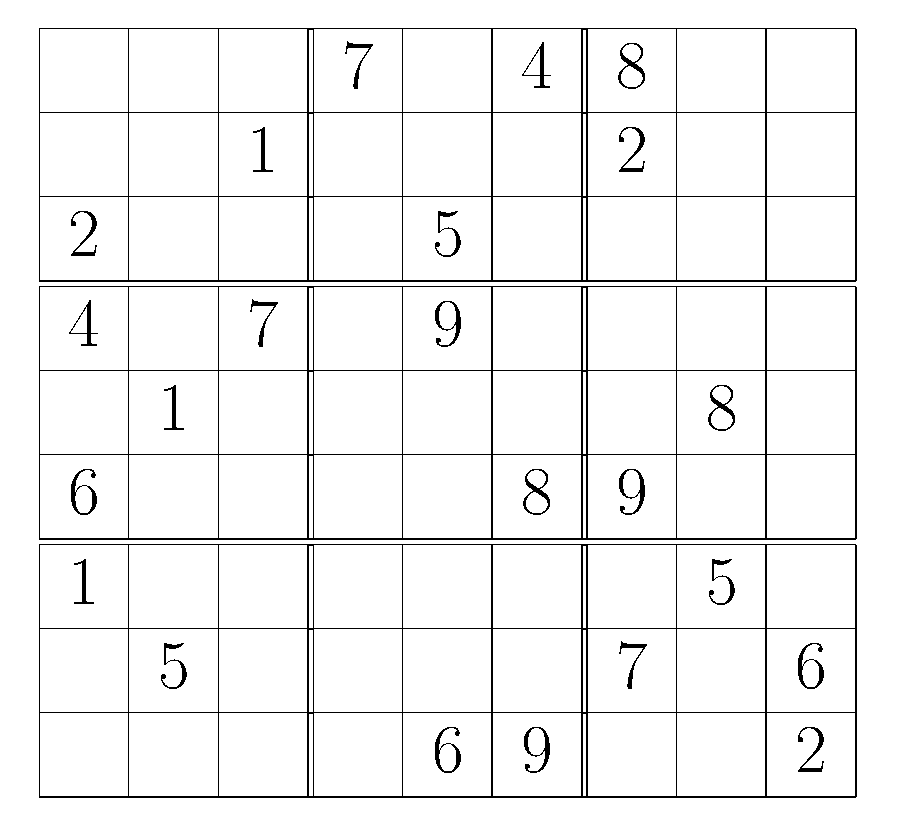
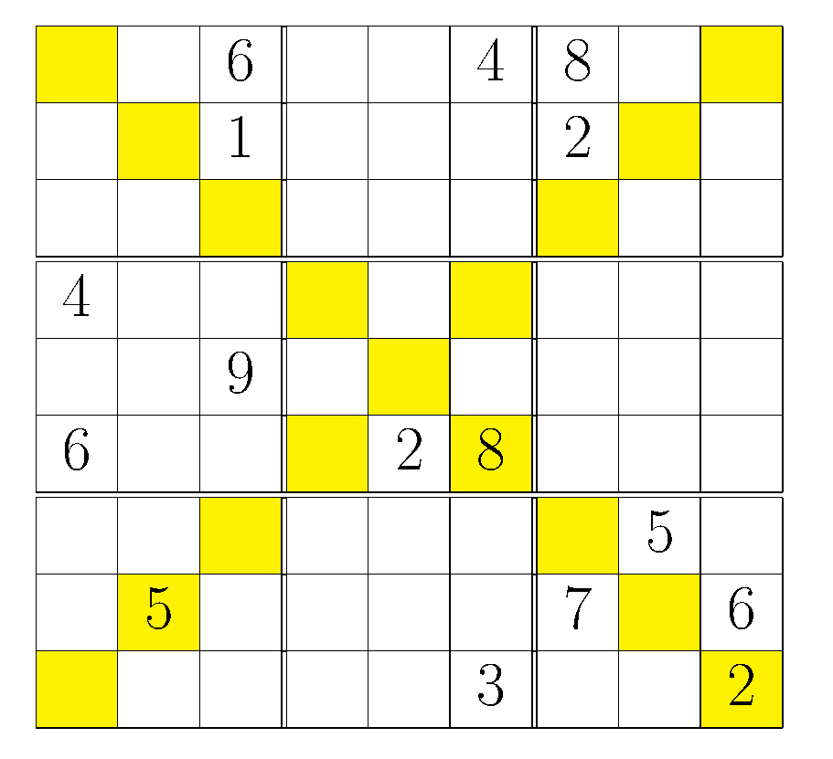
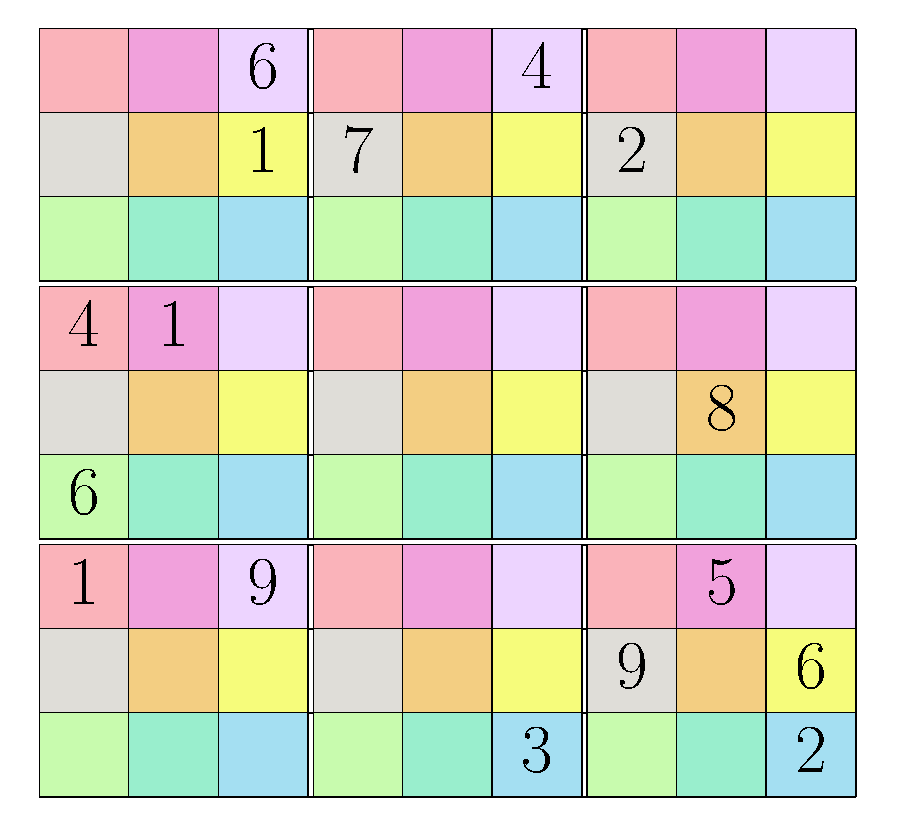

Sudoku Maker
============

.. |--| unicode:: U+2013   .. en dash

:Author: Ralf Schlatterbeck <rsc@runtux.com>

Sudoku Maker is a generator for Sudoku number puzzles. It uses a genetic
algorithm internally, so it can serve as an introduction to genetic
algorithms. The generated Sudokus are usually very hard to solve |--| good
for getting rid of a Sudoku addiction (or maybe not).

It also includes a simple depth-first solver (with some optimizations)
for sudoku puzzles |--| the solver is internally needed when generating
sudoku puzzles. The included ``sudoku`` script can be called and reads a
sudoku from standard input.  It outputs the solution (if any) or if
there isn't a single solution to the given puzzle it will output several
(up to a maximum).

It internally uses my PGApy_ wrapper for the PGApack_ genetic algorithm
library (which I'm currently also maintaining).

.. _PGApy: https://github.com/schlatterbeck/pgapy
.. _PGApack: https://github.com/schlatterbeck/pgapack

The representation of sudoku puzzles is a simple: 9 lines with 9 numbers
in each line, e.g., ::

    000704800
    001000200
    200050000
    407090000
    010000080
    600008900
    100000050
    050000706
    000069002

The numbers 1-9 represent the given numbers of the puzzle while the
zeros represent the empty tiles. A solved puzzle simply contains no
zeros. I've adopted the file extension ``.sud`` for this format.
The puzzle in the example was created by ``sudokumaker`` with the option
``-r 42`` which sets the random seed to 42 (also the default if no
``-r`` option is given), so the puzzle should be reproduceable with this
option (on a 64bit architecture).  The example above when rendered with
``sudoku_as_tex`` and compiled with LaTeX will look something like the
following:

There are some variants of sudoku puzzles supported. The first variant
adds the diagonals (so in each of the two diagonals the numbers 1-9 must
be present), this variant can be requested with the ``--diagonal``
option. A printed example (which was again generated with the random seed
42 but now with the ``--diagonal`` option) looks as follows:

For the diagonal variant I've adopted the extension ``.sudd`` |--| note
that the normal sudoku and the diagonal-constrained sudokus are not
compatible, if interpreted as a normal sudoku, a diagonal-constrained
sudoku would have multiple solutions.

The second variant requires that in each quadrant there are 9 distinct
colors, the same color is always at the same position in each quadrant.
The numbers 1-9 must be present on each of the colors.
For this variant I've adopted the extension ``.sudc``, as with
diagonal-constrained sudokus, color-constrained sudokus would have
multiple solutions if interpreted as a normal sudoku.  This variant can
be requested with the ``--colorconstrained`` option. An example looks as
follows:

Sudoku puzzles can be pretty-printed as LaTeX using the included
``sudoku_as_tex`` program. This currently supports printing the
diagonals in yellow if the ``--diagonal`` option is given.
Color-constrained sudokus can be printed with the ``--colorconstrained``
option. The following color map applies:

============ ======
color        letter
============ ======
red          r
pink         p
violet       v
grey         g
orange       o
yellow       y
light green  l
dark green   d
blue         b
============ ======

If these letters are used in the color constrained sudoku, the table
above applies. Other letters can be used, too, but the color assignment
for printing will be arbitrary in that case.

A third variant, sometimes called *kikagaku* has irregular colored
shapes *instead* of the 3X3 blocks. These can currently only be printed
using the ``--kikagaku`` option to ``sudoku_as_tex`` but *not* be
generated using ``sudokumaker``. The format I'm using for these is a
modification of the ``.sud`` format. It contains the numbers in the same
format as in ``.sud`` followed by lines with letters where each letter
represents a unique color. Of course each letter has to appear exactly 9
times.  I've not included a puzzle because I currently cannot generated
them automatically. An empty puzzle in that format would look as follows::

    000000000
    000000000
    000000000
    000000000
    000000000
    000000000
    000000000
    000000000
    000000000
    rrrrvvvvg
    brbrrvggg
    brbrovvvg
    bbbbovggg
    blooooogp
    llldopppp
    ldddoypyp
    llldyypyp
    lddddyyyy

The same color map as for color-constrained sudoku puzzle applies.
This would be rendered as follows:

For the genetic algorithm library, my python wrapper PGApy_ of the
parallel genetic algorithm library (PGApack_) is needed. There should
be Windows support for PGApy_ but I haven't tested the latest changes on
Windows.

Version 1.2: Parallel version

- If installed with a parallel (MPI) version of pgapy the evaluation can
  be parallelized
- Caching now done in ``pre_eval`` and ``endofgen``: ``pre_eval`` looks
  for hits in the cache and prevents that these individuals get
  evaluated again. The ``endofgen`` method fills the cache.
- Default for random seed is 42
- Get rid of ``--verbose`` option

Version 1.1: Add licensing information

- Add LICENSE file
- insert license headers into python files where not yet present

Version 1.0: Mark as stable, Python3

Now marked as Development Status Production/Stable

- Python3
- Stable
- Remove SF logo
- Documentation update, pictures
- Add rendered examples

Version 0.4: Packaging fixes

Fix package name again, stick to sudokumaker to avoid name collisions.

- Package namespace is now sudokumaker again
- Sudokumaker depends on rsclib.sourceforge.net

Version 0.3: Color, Diagonal

Now color constrained and diagonality constrained sudokus are supported.

- Diagonality constrained sudokus must have the digits 1-9 in the
  diagonals, too. When printing, diagonals are printed in yellow.
- Color constrained sudokus have 9 additional colors which are in the
  same position in every quadrant. These must have the digits 1-9, too.
  When printing we chose 9 different light colors.

Version 0.2: README update

The README (and the SF homepage which is generated from it) had wrong
link to the project. Also the python package index didn't accept one of
my classifier. Grmpf.

- Fix project link in README (SF Logo)
- Remove one classifier not accepted by pypi

Version 0.1: Initial Release

Sudoku Maker is a generator for Sudoku number puzzles. It uses a genetic
algorithm internally.

- First Release after a long silent development
